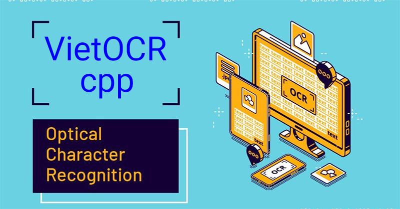
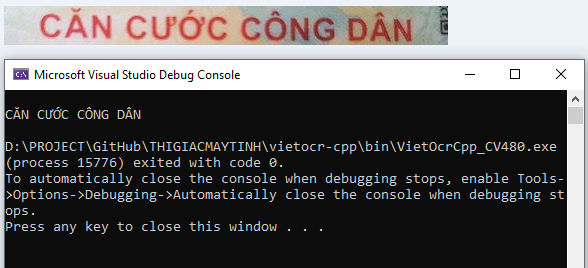

# VietOCR C++

Repository này fork từ: https://github.com/pbcquoc/vietocr

Bài viết chi tiết: https://thigiacmaytinh.com/share-source-code-vietocr-da-port-sang-ngon-ngu-c/

## Hướng dẫn cách build

- Visual Studio 2022
- Libtorch cpp 2.2.1: download và copy các file dll vào folder bin

Khi build VietOcrCpp_CV480.sln thì Visual Studio sẽ tự động download package Microsoft.ML.OnnxRuntime.1.17.1.

Kết quả như hình dưới:

